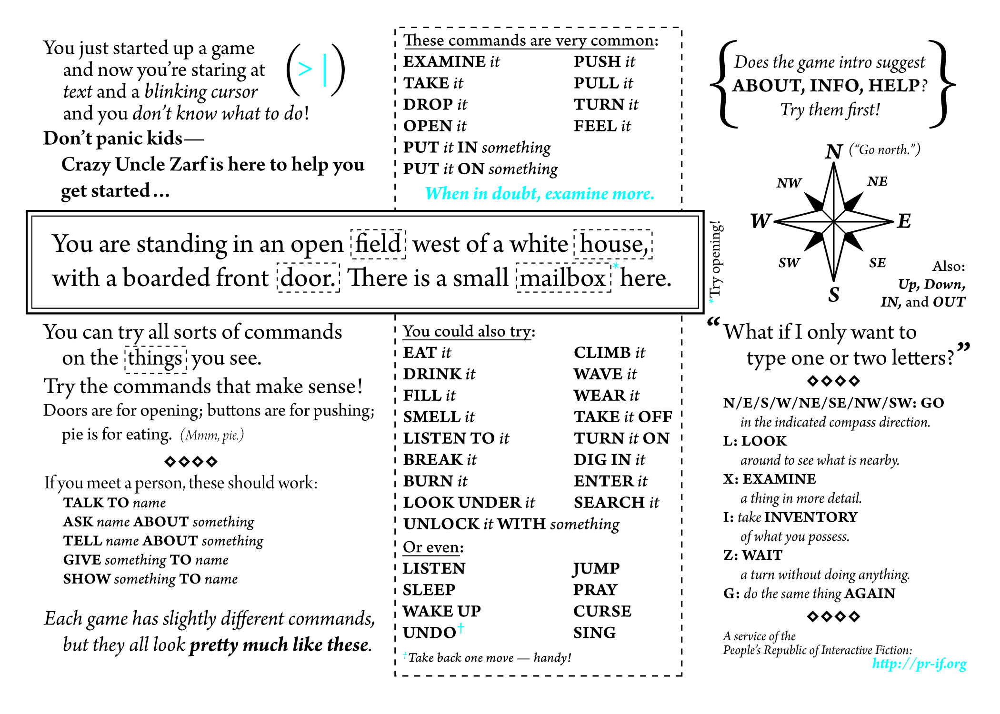

# Kimmy's IF Collection

## Useful links

- [IFDB](https://ifdb.org/)
- [IF Wiki](https://www.ifwiki.org/)
- [If Archive](https://ifarchive.org/)
- [IF Reviews](https://www.ifreviews.org/)
- [IFComp](https://ifcomp.org/)
- [Interactive Fiction Community Forum](https://intfiction.org/)

- [Text Adventures](https://textadventures.co.uk/)

- [Brass Lantern](http://www.brasslantern.org/)
- [Baf's Guide](https://www.wurb.com/if/)
- [SPAG magzine](http://www.spagmag.org/archives/)

## Playing

### Guides

- [A Beginner's Guide to Playing Interactive Fiction](https://www.microheaven.com/IFGuide/)
- [Let's Tell a Story Together (A History of Interactive Fiction)](http://maher.filfre.net/if-book/index.html)

### Tools

- [Frotz](https://davidgriffith.gitlab.io/frotz/)
- [Map tool](./tools/map/ifmap.html)

### Games

- [Interactive Fiction Entrees](https://nickm.com/if/rec.html)
- [Interactive Fiction Top 50 of All Time (2011 edition)](https://ifdb.org/viewcomp?id=oymvom4wrawhd4hr)
- [The Best of Interactive Fiction](https://web.archive.org/web/20041102032656/http://www.igs.net/~tril/if/best/)
- [Suggested Works of Modern IF](http://maher.filfre.net/if-book/if-10.htm)
- [my favourite and least favourite IF (Stephen Bond)](https://web.archive.org/web/20091113131724/http://plover.net/~bonds/bwif.html)
- [The Best Free Interactive Fiction Of The Century (Collected by Michael Feir, Editor of Audyssey)](https://web.archive.org/web/20080512001116/http://www.bioc.rice.edu/~lpsmith/IF/50best.html)
- [Emily Short's Game Lists](https://emshort.blog/category/game-lists/)
- [ADRIFT Recommended Games](https://www.ifwiki.org/ADRIFT_Recommended_Games)
- [The Digital Antiquarian](https://www.filfre.net/)

- [ZORK Series](./games/z-machine/zork/README.md)

## Authoring

- [Inform 7](https://inform7.com/)
- [Inform 6](https://inform-fiction.org/)
- [Borogove](https://borogove.app/)

- [Inform - A Design System for Interactive Fiction](https://zedlopez.github.io/i7doc/index.html)
- [Inform 7 Programmer's Manual](https://zedlopez.github.io/i7doc/i7prog/index.html)

- [Inweb - A modern system for literate programming](https://ganelson.github.io/inweb/inweb/index.html)

- [Computational Approaches to Narrative](https://catn.decontextualize.com/)
- [Hypertext and Interactive Fiction](https://hypertext.decontextualize.com/)

## Other links and articles

- The Maze and the Other in Interactive Fiction On Labyrinths, the Infinite, and the Compass
  https://samplereality.com/2018/07/17/the-maze-and-the-other-in-interactive-fiction/

- [My Posts](/posts.md)

### Non-IF but console game (mostly roguelike)

- [Nethack](https://www.nethack.org/index.html)
  - Graphical version: [Pathos](https://pathos.azurewebsites.net/)
- [Cataclysm: Dark Days Ahead](https://cataclysmdda.org/)
- [Angband](https://rephial.org/)
- [Dwarf Fortress Classic](https://www.bay12games.com/dwarves/)
- [Dungeon Crawl Stone Soup](https://crawl.develz.org/)

- [UMoria](https://umoria.org/)
- [A.D.O.M.: Ancient Domain Of Mystery](https://www.adom.de/home/index.html)
- [DRL: Doom the roguelike](https://drl.chaosforge.org/)
- [Ascii Sector](https://www.asciisector.net/)

- [GNU Chess](https://www.gnu.org/software/chess/)
- [Course of War](https://a-nikolaev.github.io/curseofwar/)
- [Pokete](https://lxgr-linux.github.io/pokete/)

- [Omega RPG](https://github.com/cwc/OmegaRPG)
- [Bastet](https://fph.altervista.org/prog/bastet.html)
- [Trek](https://en.wikipedia.org/wiki/Star_Trek_(1971_video_game))

### Possibly non-terminal but with similiar style

- [Brogue: Community Edition](https://sites.google.com/site/broguegame/)
- [Tales of Maj'Eyal](https://te4.org/)
- [Caves of Qud](https://www.cavesofqud.com/)
- [Cogmind](https://www.gridsagegames.com/cogmind/)
- [Path of Achra](https://pathofachra.com/)
